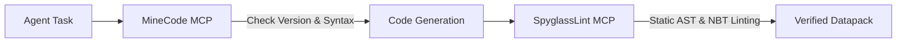

# datapack-mcp

datapack-mcp is an AI agent development plugin and static analysis toolkit for Minecraft datapacks, combining [MineCode MCP](https://github.com/AnCarsenat/minecode-mcp) and [Spyglass Language Server](https://github.com/SpyglassMC/Spyglass).

## Prerequisites

- **Node.js**: v18.0.0 or later
- **Python** (for MineCode MCP): Python 3.10+ or [`uv`](https://docs.astral.sh/uv/) (recommended)
- **VS Code Extension** (for Spyglass LSP): [Datapack Helper Plus](https://marketplace.visualstudio.com/items?itemName=spgoding.datapack-language-server) installed in VS Code, Cursor, or VSCodium (or specify custom path via `SPYGLASS_SERVER_PATH` environment variable)

## Install

### Claude Code

```text
/plugin marketplace add minkyet/datapack-mcp
/plugin install datapack-mcp
```

### Codex

#### Codex CLI
```bash
codex plugin marketplace add minkyet/datapack-mcp
codex plugin add datapack-mcp@datapack-devkit-marketplace
```

#### Codex App (GUI)
1. In the Codex App - open **Plugins** from the sidebar.
2. Click the arrow next to Create, then select Add marketplace.
3. Enter:
   - **Source**: `minkyet/datapack-mcp`
   - **Git ref**: `main`
   - **Sparse paths**: (leave blank)
4. Click **Add marketplace**, select **datapack-mcp** plugin from list and install.
5. Restart Codex.

### Antigravity CLI (`agy`)

```bash
agy plugin install https://github.com/minkyet/datapack-mcp
```

## Usage

### Dual-MCP Agent Architecture

This plugin provides a two-stage development workflow for AI agents:
1. **Pre-Generation (MineCode MCP)**: Real-time version specification, Brigadier command usage, and Misode vanilla preset data to prevent LLM hallucinations.
2. **Post-Generation (SpyglassLint MCP)**: Local Language Server AST diagnostics, mcdoc/NBT schema type checks, and cross-reference integrity verification.



### 1. SpyglassLint MCP (Static Linter & Diagnostics)

Provides persistent, sub-second Language Server AST parsing, mcdoc schema checking, and project-wide cross-reference validation.

| MCP Tool | Description | Parameters |
| :--- | :--- | :--- |
| `spyglass_diagnose_file` | File-level syntax, mcdoc/NBT schemas, and real-time diagnostics for symbol reference errors. | `file_path`, `content` (optional) |
| `spyglass_analyze_project` | Full inspection of AST and cross-references (function calls, tags, etc.) for all files within the datapack. | `workspace_path` (optional) |
| `spyglass_set_workspace` | Explicitly switch or set the active datapack workspace root directory for the LSP daemon. | `workspace_path` |
| `spyglass_restart_server` | Restart LSP process and reload `spyglass.json` / `pack.mcmeta` settings. | none |
| `spyglass_get_status` | Retrieve LSP server readiness status, target Minecraft version, and workspace information. | none |

### 2. MineCode MCP (Version & Knowledge Reference)

Run automatically via Node.js bootstrap runner (`uvx` / `pipx` / `python3 venv`). Provides 30 reference tools across 5 categories:

#### Category Overview

| Category | Tools | Description |
| :--- | :--- | :--- |
| **Session & Version** | `minecraft_start_session`, `detect_pack_version`, `get_technical_changes`, `list_technical_change_versions`, `pack_format_to_version`, `version_to_pack_format`, `check_pack_structure`, `check_version_syntax` | Version detection, breaking changes, pack format conversions, and layout validation |
| **Command Syntax** | `get_command_usage`, `validate_command` | Brigadier-compiled command signatures and syntax validation |
| **Vanilla Presets** | `misode_get_preset_data`, `misode_get_presets`, `misode_get_loot_tables`, `misode_get_recipes`, `misode_get_generators`, `misode_list_versions` | Official vanilla JSON shapes from Misode generators |
| **Spyglass Web API** | `spyglass_get_mcdoc_symbol`, `spyglass_search_mcdoc_symbols`, `spyglass_get_registries`, `spyglass_get_block_states`, `spyglass_get_commands`, `spyglass_get_versions` | Version-exact registries, block states, and field-level mcdoc schemas |
| **Wiki & Diagnostics** | `search_wiki`, `get_wiki_page`, `get_wiki_commands`, `get_wiki_command_explanation`, `get_wiki_category`, `search_mojira`, `get_logs`, `cache_status` | Minecraft Wiki explanations, Mojira bug tracker, local logs, and cache control |

#### Tool Reference

<details open>
<summary><b>Session & Version Management</b></summary>

| MCP Tool | Description | Parameters |
| :--- | :--- | :--- |
| `minecraft_start_session` | Detect target version from `pack.mcmeta`, retrieve breaking changes and recommended workflow. Call first before editing datapacks. | `workspace_path` (optional) |
| `detect_pack_version` | Read `pack.mcmeta` and return target Minecraft version, pack format, and supported features. | `path` (optional) |
| `get_technical_changes` | Technical changelog and breaking changes between versions (e.g. 1.20.5 component migration, 1.21 folder singularization). | `to_version`, `from_version` (optional), `topic` (optional) |
| `list_technical_change_versions` | List Minecraft versions with available technical changelogs. | none |
| `pack_format_to_version` | Map `pack_format` number to corresponding Minecraft version(s). | `pack_format`, `kind` (optional) |
| `version_to_pack_format` | Get data and resource pack format numbers for a target Minecraft version. | `version` |
| `check_pack_structure` | Check datapack folder layout against target version (e.g. singular folder names in 1.21+). | `path` (optional), `version` (optional) |
| `check_version_syntax` | Scan a command, JSON, or SNBT snippet for version-incompatible syntax. | `content`, `version`, `kind` (optional) |

</details>

<details open>
<summary><b>Command Syntax & Validation</b></summary>

| MCP Tool | Description | Parameters |
| :--- | :--- | :--- |
| `get_command_usage` | Readable, version-exact syntax and argument signatures compiled from the game's Brigadier grammar. | `command`, `version`, `max_lines` (optional) |
| `validate_command` | Parse command against real Brigadier grammar for a target version and report valid/invalid tokens. | `command`, `version` |

</details>

<details open>
<summary><b>Vanilla Presets & Generators (Misode)</b></summary>

| MCP Tool | Description | Parameters |
| :--- | :--- | :--- |
| `misode_get_preset_data` | Fetch authentic vanilla JSON presets for a target version (loot tables, recipes, advancements, biomes, etc.). | `generator_type`, `preset_id`, `version` |
| `misode_get_presets` | List vanilla preset IDs for a given generator type in a specific version. | `generator_type`, `version`, `search` (optional) |
| `misode_get_loot_tables` | List vanilla loot table IDs by category (blocks, chests, entities, etc.). | `version`, `category` (optional), `search` (optional) |
| `misode_get_recipes` | List vanilla recipe IDs for a version (optionally filtered by recipe type). | `version`, `recipe_type` (optional), `search` (optional) |
| `misode_get_generators` | List Misode web-based generator URLs for visual editing reference. | `category` (optional) |
| `misode_list_versions` | List Minecraft versions available on Misode generator presets. | none |

</details>

<details open>
<summary><b>Spyglass Web API (Schemas & Registries)</b></summary>

| MCP Tool | Description | Parameters |
| :--- | :--- | :--- |
| `spyglass_get_mcdoc_symbol` | Retrieve authoritative field-level mcdoc schema for a Minecraft data structure (components, NBT, loot conditions, etc.). | `symbol`, `depth` (optional) |
| `spyglass_search_mcdoc_symbols` | Search mcdoc symbol paths by keyword to find identifiers for `spyglass_get_mcdoc_symbol`. | `query`, `limit` (optional) |
| `spyglass_get_registries` | List valid IDs in a registry for a target version (items, blocks, entity types, biomes, enchantments, attributes, etc.). | `registry`, `version`, `search` (optional) |
| `spyglass_get_block_states` | Get all block state properties and default values for a specific block in a target version. | `block_id`, `version` |
| `spyglass_get_commands` | Raw Brigadier command tree or command listing for a target version. | `version`, `command` (optional) |
| `spyglass_get_versions` | List Minecraft Java Edition versions with data/resource pack format mappings. | `limit` (optional), `type_filter` (optional) |

</details>

<details open>
<summary><b>Wiki & Diagnostics</b></summary>

| MCP Tool | Description | Parameters |
| :--- | :--- | :--- |
| `search_wiki` | Search Minecraft Wiki for gameplay concepts and mechanics (latest version). | `query`, `limit` (optional), `fulltext` (optional) |
| `get_wiki_page` | Fetch page content from Minecraft Wiki. | `title`, `full` (optional), `sentences` (optional) |
| `get_wiki_commands` | List all command pages available on Minecraft Wiki. | `limit` (optional) |
| `get_wiki_command_explanation` | Get Minecraft Wiki explanation of a specific command. | `command` |
| `get_wiki_category` | List pages under a Minecraft Wiki category. | `category`, `limit` (optional) |
| `search_mojira` | Search Mojira bug tracker to check known Mojang bugs. | `query` (optional), `project` (optional), `status` (optional), `resolution` (optional), `page` (optional) |
| `get_logs` | Read local Minecraft launcher and instance log files for debugging. | `filter` (optional), `instance` (optional), `launcher` (optional), `lines` (optional), `tail` (optional) |
| `cache_status` | Inspect or clear MineCode on-disk HTTP response cache. | `clear` (optional) |

</details>

### SpyglassLint as standalone CLI

To use the `spyglasslint` CLI command directly from the terminal:

```bash
npm link
```

#### CLI usage

```bash
# Static analysis of a single file
spyglasslint data/my_pack/function/my_func.mcfunction

# Full analysis of all files in the datapack project
spyglasslint --all

# Output analysis results in JSON format
spyglasslint --all --json

# Analyze by specifying the datapack workspace path
spyglasslint --all -w /path/to/datapack
```

#### CLI options

```text
Usage: spyglasslint [options] [file_path]

Options:
  -a, --all               Run project-wide analysis across all files
  --json                  Output raw JSON diagnostics instead of formatted text
  -w, --workspace <dir>   Set workspace root directory (default: auto-detected)
  -h, --help              Show help information
```

## Acknowledgments & Upstream Sources

This plugin integrates and builds upon the following open-source projects:

- **[MineCode MCP](https://github.com/AnCarsenat/minecode-mcp)** by [@AnCarsenat](https://github.com/AnCarsenat): Minecraft command syntax, technical breaking changes, Misode vanilla generator presets, and wiki documentation reference MCP server.
- **[Spyglass](https://github.com/SpyglassMC/Spyglass)** by [SpyglassMC](https://github.com/SpyglassMC): Minecraft datapack & resource pack Language Server and mcdoc type system for static AST analysis, NBT schema checking, and symbol diagnostics.

## License

MIT License
