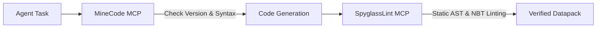

# Datapack DevKit

Datapack DevKit is an AI agent development plugin and static analysis toolkit for Minecraft datapacks, combining [MineCode MCP](https://github.com/AnCarsenat/minecode-mcp) and [Spyglass Language Server](https://github.com/SpyglassMC/Spyglass).

## Install

### Claude Code

```text
/plugin marketplace add minkyet/datapack-devkit
/plugin install datapack-devkit
```

### Codex

#### Codex CLI
```bash
codex plugin marketplace add minkyet/datapack-devkit
codex plugin add datapack-devkit@datapack-devkit-marketplace
```

#### Codex App (GUI)
1. In the Codex App - open **Plugins** from the sidebar.
2. Click the arrow next to Create, then select Add marketplace.
3. Enter:
   - **Source**: `minkyet/datapack-devkit`
   - **Git ref**: `main`
   - **Sparse paths**: (leave blank)
4. Click **Add marketplace**, select **datapack-devkit** plugin from list and install.
5. Restart Codex.

### Antigravity CLI (`agy`)

```bash
agy plugin install https://github.com/minkyet/datapack-devkit
```

---

### Link/Install as a standalone CLI tool

To use the `spyglass-lint` CLI command directly from the terminal:

```bash
npm link
```

## Usage

### Dual-MCP Agent Architecture

This plugin provides a two-stage development workflow for AI agents:
1. **Pre-Generation (MineCode MCP)**: Real-time version specification, Brigadier command usage, and Misode vanilla preset data to prevent LLM hallucinations.
2. **Post-Generation (SpyglassLint MCP)**: Local Language Server AST diagnostics, mcdoc/NBT schema type checks, and cross-reference integrity verification.



### 1. SpyglassLint MCP (Static Linter & Diagnostics)

| MCP Tool | description | parameters |
| :--- | :--- | :--- |
| `spyglass_diagnose_file` | file-level syntax, mcdoc/NBT schemas, and real-time diagnostics for symbol reference errors. | `file_path`, `content` (optional) |
| `spyglass_analyze_project` | full inspection of AST and cross-references (function calls, tags, etc.) for all files within the datapack. | none |
| `spyglass_restart_server` | restart LSP process and reload `spyglass.json` / `pack.mcmeta` setting. | none |
| `spyglass_get_status` | retrieve LSP server readiness status, target Minecraft version, and workspace information. | none |

### 2. MineCode MCP (Version & Knowledge Reference)

Run automatically via Node.js bootstrap runner (`uvx` / `pipx` / `python3 venv`).

| Category | Key MCP Tools | Description |
| :--- | :--- | :--- |
| **Session & Version** | `minecraft_start_session`, `detect_pack_version`, `get_technical_changes` | Read `pack.mcmeta` and retrieve version-specific breaking changes |
| **Command Syntax** | `get_command_usage`, `validate_command` | Brigadier-compiled command usage patterns and token validation |
| **Vanilla Presets** | `misode_get_preset_data`, `misode_get_loot_tables`, `misode_get_recipes` | Official vanilla JSON shapes from Misode generators |
| **Spyglass Web API** | `spyglass_get_registries`, `spyglass_get_mcdoc_symbol`, `spyglass_get_commands` | Version-exact registries and field-level mcdoc schemas |
| **Wiki & Docs** | `search_wiki`, `get_wiki_page` | Minecraft wiki search and explanations |


### CLI Usage

```bash
# 1. Static analysis of a single file
spyglass-lint data/my_pack/function/my_func.mcfunction

# 2. Full analysis of all files in the datapack project
spyglass-lint --all

# 3. Output analysis results in JSON format
spyglass-lint --all --json

# 4. Analyze by specifying the datapack workspace path
spyglass-lint --all -w /path/to/datapack
```

#### CLI options

```text
Usage: spyglass-lint [options] [file_path]

Options:
  -a, --all               Run project-wide analysis across all files
  --json                  Output raw JSON diagnostics instead of formatted text
  -w, --workspace <dir>   Set workspace root directory (default: auto-detected)
  -h, --help              Show help information
```


## Prerequisites

- **Node.js**: v18.0.0 or later
- **Python** (for MineCode MCP): Python 3.10+ or [`uv`](https://docs.astral.sh/uv/) (recommended)
- **VS Code Extension** (for Spyglass LSP): [Datapack Helper Plus](https://marketplace.visualstudio.com/items?itemName=spgoding.datapack-language-server) installed in VS Code, Cursor, or VSCodium (or specify custom path via `SPYGLASS_SERVER_PATH` environment variable)


## Acknowledgments & Upstream Sources

This plugin integrates and builds upon the following open-source projects:

- **[MineCode MCP](https://github.com/AnCarsenat/minecode-mcp)** by [@AnCarsenat](https://github.com/AnCarsenat): Minecraft command syntax, technical breaking changes, Misode vanilla generator presets, and wiki documentation reference MCP server.
- **[Spyglass](https://github.com/SpyglassMC/Spyglass)** by [SpyglassMC](https://github.com/SpyglassMC): Minecraft datapack & resource pack Language Server and mcdoc type system for static AST analysis, NBT schema checking, and symbol diagnostics.

## License

MIT License
